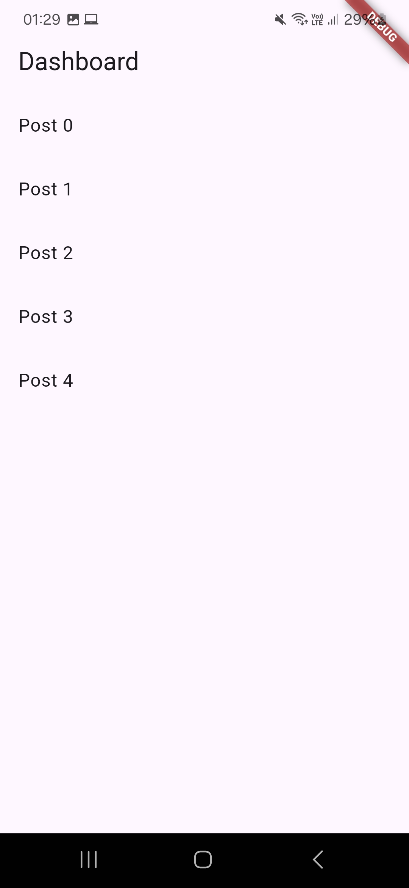

# LittleCow 
## Entorno de desarrollo
| Componente| Version | 
|----------|----------|
| Flutter    |  3.29.2  | 
| Dart    | 3.7.2   | 
| Android Studio    | 2024.3 | 
| Android SDK  | 35.0.1 | 
---
## Instalación Detallada
Todos los pasos técnicos están en:  
[**INSTALL.md**](INSTALL.md)

## Ejecución del Proyecto
Sigue estos pasos para configurar y ejecutar el proyecto localmente:
```bash
# 1. Clonar repositorio
git clone https://github.com/jokoframework/littlecow.git
cd littlecow

# 2. Limpiar el proyecto 
flutter clean

# 3. Instalar dependencias
flutter pub get

# 4. Ejecutar (usar tu dispositivo conectado o emulador)
flutter run
```

### Ejecutar en Linux Desktop
Para ejecutar específicamente en tu escritorio Linux, sigue estos pasos:

```bash
# 1. Verificar las dependencias necesarias para desarrollo en Linux
sudo apt-get update
sudo apt-get install clang cmake ninja-build pkg-config libgtk-3-dev liblzma-dev
```
```bash
# 2. Habilitar soporte para Linux (si aún no está habilitado)
flutter config --enable-linux-desktop
```
```bash
# 3. Ejecutar específicamente para Linux desktop
flutter run -d linux
```

## Capturas de Pantalla

### Pantalla de Login


### Listado de Posts


